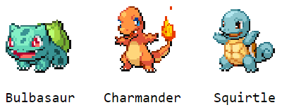

# Recap

Let's do a short recap of the presented topics. We are going to create a Pokédex, where one can click each Pokémon to see its evolutionary stages. Run `npm run 00s` from the project root if you wish to see the complete application, shown in the image below.



<br><br>

A list of Pokémon evolutions is included in the project. The file `pokemon.js` contains a list of evolution object, like the one displayed in the code block below. Each element in the list has an `id` and the tree Pokémon: `first` evolves into `second` and `second` evolves into `third`. Each Pokémon has a `name` and an `imageUrl`.
```js
{
    id: 0,
    first: {
        name: "Bulbasaur",
        imageUrl: "https://.../1.gif",
    },
    second: {
        name: "Ivysaur",
        imageUrl: "https://.../2.gif",
    },
    third: {
        name: "Venusaur",
        imageUrl: "https://.../3.gif",
    }
}
```

<br><br>

#### 📌 Task 1 - Run the 00-recap project
Run `npm run 00` from the project root and open `00-recap/src/App.jsx` is VS Code. When your application runs and you see the word `Pokédex`, you have successfully completed the task.

<br><br>

#### 📌 Task 2 - Render the first pokemon in each evolution
Use the `<Avatar name={} imageUrl={} />` component created the first day to display Pokémon. Map each evolution of three Pokémon in `pokemonList` to an `Avatar` displaying only the first Pokémon in each evolutionary chain.

Remember to give each component in the list a `key` prop. Destructure the variables when mapping the list. As the Pokémon object contains the same fields as `Avatar`'s props, the spread operator can be used to apply them to the `Avatar` component.

<details><summary>💡 Hint</summary>

```jsx
const App = () =>
  pokemonList.map(({ /* destructure */ }) =>
    <Avatar key={ /* key */ } { ...first } />
  )
```
</details>

<details><summary>🔑 Solution</summary>

```jsx
import React, { useState } from 'react'

import Avatar from "./Avatar"
import pokemonList from "./pokemon"

const App = () =>
  pokemonList.map(({ id, first }) =>
    <Avatar key={id} {...first} />
  )

export default App
```
</details>

<br><br>

#### 📌 Task 3 - Ceate a Pokemon components that renders all three evolutionary stages
In `App.jsx`, create a `Pokemon` component that accepts the props `first`, `second`, and `third`. The component should display all three Pokémon inside a fragment `<> </>`.

Now use the `Pokemon` component in the map function created earlier, instead of only showing an `Avatar` with the first Pokemon. If you are up for a challenge, use the rest notatin when destructuring, and spread notation when mapping.
<details><summary>💡 Hint</summary>

```js
.map({ id, ...pokemon }) => <Pokemon id={key} { ...pokemon } />
```
</details>
<details><summary>🔑 Solution</summary>

```jsx
import React, { useState } from 'react'

import Avatar from "./Avatar"
import pokemonList from "./pokemon"

const Pokemon = ({ first, second, third }) => {
  return <>
    <Avatar {...first} />
    <Avatar {...second} />
    <Avatar {...third} />
  </>
}

const App = () =>
  pokemonList.map(({ id, ...pokemon }) =>
    <Pokemon key={id} {...pokemon} />
  )

export default App
```
</details>

<br><br>

#### 📌 Task 4 - Ceate a `pokeState` and render only one of the three Pokémon
We now have a complete Pokédex displaying all the pokemon. Instead, only display one Pokémon for each evolutionary chain, either `first`, `second`, or `third`.

Inside the `Pokemon` component, create a state called `pokeState` with the inital value `1`. Then conditionally render only one of the three avatars inside the component, depending on the value of the state.

When finished, replace the initial state with `2` and save. All the pokemon should update. Now try with `3` and then finally go back to `1` before moving on.

<details><summary>💡 Hint</summary>

```jsx
const [ /* destructure */ ] = useState(1)

return <>
   { /* condition */ && <Avatar {...first} /> }
   { /* second */ }
   { /* third */ }
</>
```
</details>
<details><summary>🔑 Solution</summary>

```jsx
import React, { useState } from 'react'

import Avatar from "./Avatar"
import pokemonList from "./pokemon"

const Pokemon = ({ first, second, third }) => {
  const [pokeState, setPokeState] = useState(1)

  return <>
    { pokeState === 1 && <Avatar {...first} /> }
    { pokeState === 2 && <Avatar {...second} /> }
    { pokeState === 3 && <Avatar {...third} /> }
  </>
}

const App = () =>
  pokemonList.map(({ id, ...pokemon }) =>
    <Pokemon key={id} {...pokemon} />
  )

export default App
```
</details>

<br><br>

#### 📌 Task 5 - Create a `handleClick` function that updates the state
The `handleClick` function should increase the `pokeState` by one, and set it back to `1` instead of going out of range.

Inside the `Pokemon` component, replace the fragments `<> </>` with a clickable `<div> </div>` element and add the `handleClick` as `onClick`.

When you are done, try clicking some Pokémon to see what they evolve into. 

<details><summary>💡 Hint</summary>

```jsx
const handleClick = () => {
  setPokeState( /* new pokestate */ )
}
```
</details>
<details><summary>🔑 Solution</summary>

```jsx
import React, { useState } from 'react'

import Avatar from "./Avatar"
import pokemonList from "./pokemon"

const Pokemon = ({ first, second, third }) => {
  const [pokeState, setPokeState] = useState(1)

  const handleClick = () => {
    setPokeState(pokeState < 3 ? pokeState + 1 : 1)
  }

  return <div onClick={handleClick}>
    { pokeState === 1 && <Avatar {...first} /> }
    { pokeState === 2 && <Avatar {...second} /> }
    { pokeState === 3 && <Avatar {...third} /> }
  </div>
}

const App = () =>
  pokemonList.map(({ id, ...pokemon }) =>
    <Pokemon key={id} {...pokemon} />
  )

export default App
```
</details>

<br><br>

#### 💎 Task 6 - Remove the slight delay between clicking a Pokemon and showing the next
The first time a Pokemon is clicked, the browser will have to fetch the next image. Avoid this by preloading all images when the application begins. You can accomplish this by creating an invisible `img` element with the `src` you want to prefetch.

<details><summary>💡 Hint</summary>

```jsx

```
</details>
<details><summary>🔑 Solution</summary>

```jsx
import React, { useState } from 'react'

import Avatar from "./Avatar"
import pokemonList from "./pokemon"

const Pokemon = ({ first, second, third }) => {
  const [pokeState, setPokeState] = useState(1)

  const handleClick = () => {
    setPokeState(pokeState < 3 ? pokeState + 1 : 1)
  }

  return <div onClick={handleClick}>
    { pokeState === 1 && <Avatar {...first} /> }
    { pokeState === 2 && <Avatar {...second} /> }
    { pokeState === 3 && <Avatar {...third} /> }
    
    
  </div>
}

const App = () =>
  pokemonList.map(({ id, ...pokemon }) =>
    <Pokemon key={id} {...pokemon} />
  )

export default App
```
</details>